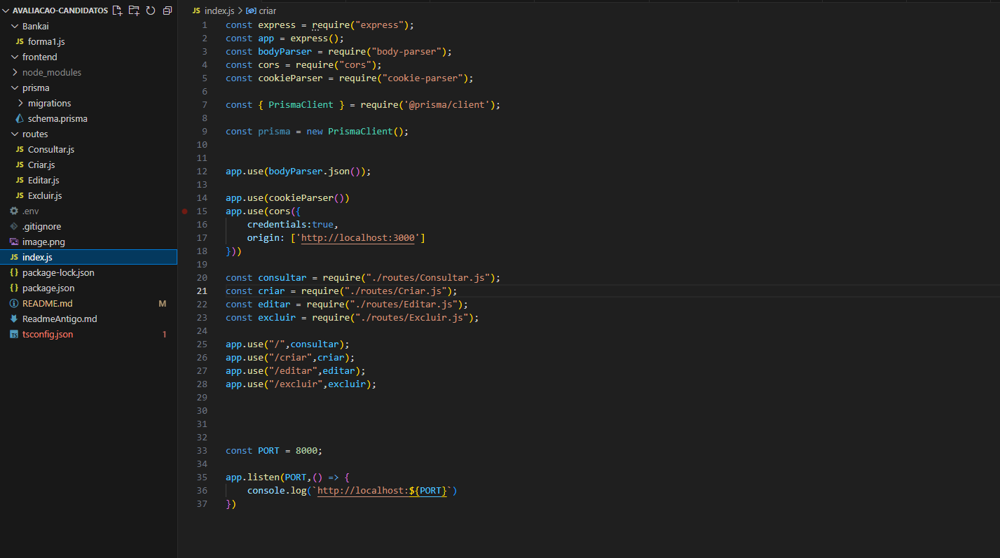
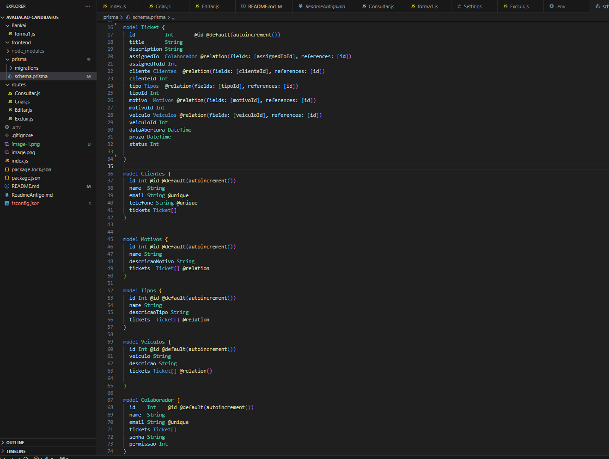

## Introdução
O projeito foi desenvolvido somente até a parte do Back-end, com Node JS. As principais implementações foram até o `Nível 4`, logo conta com:
- Autenticação JWT
- Login e Registro
- Validação
- Persistência (PostgreSQL) e ORM Prisma
- Crud (Criar, Registrar, Atualizar(Update) e Deletar)

Caso esteja se perguntando do porque existe um pasta chamada `Bankai` onde se encontra um arquivo javascript, é apenas para formatação, coisas simples como data, status e em um futuro proximo para o cliente pode ser feito, para listar por prioridade.

## Objetivo do Projeto / Problema / Desafio
O stakeholder da Comigotech solicitou uma nova funcionalidade para o gerenciamento de tickets.
Diariamente, nossa equipe precisa lidar com um grande volume de tickets, e o processo manual estava deixando todos sobrecarregados!
Os tickets são registros digitais de solicitações, processos e problemas a serem resolvidos. Para a Comigotech, é essencial integrar essas informações no fluxo de trabalho para atender nossos clientes de forma eficiente.

## Organização do Código (Arquitetura)
De um ponto de vista geral essas são as pastas do projeto, foram pensadas para a facilidade de manutenção.

Arquivo `index.js` que é o core da API o servidor propriamente dito.

Do Prisma e suas tabelas

## Rodando o Projeto
Para rodar o projeto é bem simples, basta fazer o download ou com proprio git acessar diretório.
Após acessar inicie com um `npm install`, quando concluir rode com o comando do `node index.js` na pasta do projeto.
A api quando estiver rodando vai estar utilizando da porta `8000` -> `http://localhost:8000/`
Para testar as rotas de cadastro e exclusão utilize algum programa como Insominia para fazer as requisições

## Rotas da API

**Base URL**: `http://localhost:8000/`

Estas são as rotas disponíveis para a API. Utilize a URL base acima com as seguintes rotas no Insomnia ou Postman para testar os endpoints:

### /tickets
- **Descrição**: Retorna uma lista de todos os tickets, incluindo informações relacionadas.
- **Response**:
  - 200: Sucesso, retorna a lista de tickets formatada.
  - 401: Não autenticado, token JWT inválido ou ausente.
  - 500: Erro no servidor, retorna a mensagem de erro.

### /tipos
- **Descrição**: Retorna uma lista de todos os tipos.
- **Response**:
  - 200: Sucesso, retorna a lista de tipos.
  - 401: Não autenticado, token JWT inválido ou ausente.
  - 500: Erro no servidor, retorna a mensagem de erro.

### /motivos
- **Descrição**: Retorna uma lista de todos os motivos.
- **Response**:
  - 200: Sucesso, retorna a lista de motivos.
  - 401: Não autenticado, token JWT inválido ou ausente.
  - 500: Erro no servidor, retorna a mensagem de erro.

### /colaboradores
- **Descrição**: Retorna uma lista de todos os colaboradores.
- **Response**:
  - 200: Sucesso, retorna a lista de colaboradores.
  - 401: Não autenticado, token JWT inválido ou ausente.
  - 500: Erro no servidor, retorna a mensagem de erro.

### /clientes
- **Descrição**: Retorna uma lista de todos os clientes.
- **Response**:
  - 200: Sucesso, retorna a lista de clientes.
  - 401: Não autenticado, token JWT inválido ou ausente.
  - 500: Erro no servidor, retorna a mensagem de erro.

### /veiculos
- **Descrição**: Retorna uma lista de todos os veículos.
- **Response**:
  - 200: Sucesso, retorna a lista de veículos.
  - 401: Não autenticado, token JWT inválido ou ausente.
  - 500: Erro no servidor, retorna a mensagem de erro.

### /colaborador
- **Descrição**: Retorna as informações do colaborador autenticado.
- **Response**:
  - 200: Sucesso, retorna as informações do colaborador.
  - 401: Não autenticado, token JWT inválido ou ausente.
  - 500: Erro no servidor, retorna a mensagem de erro.

### /ticket/:id
- **Descrição**: Retorna as informações de um ticket específico com base no ID fornecido.
- **Headers**:
  - `Cookie`: `jwt` - Token JWT para autenticação.
- **Request Parameters**:
  - `id` (integer): ID do ticket a ser consultado.
- **Response**:
  - 200: Sucesso, retorna os dados do ticket consultado.
  - 401: Não autenticado, token JWT inválido ou ausente.

### /login
- **Descrição**: Autentica um usuário com base no email e senha fornecidos. Retorna um token JWT se as credenciais forem válidas.
- **Request Body**:
  - `email` (string): O email do usuário.
  - `senha` (string): A senha do usuário.
- **Response**:
  - 200: Sucesso, retorna uma mensagem de sucesso.
  - 404: Usuário não encontrado ou senha inválida.
  - 500: Erro no servidor, retorna a mensagem de erro.

  ### /logout
- **Descrição**: Realiza o logout do usuário, invalidando o token JWT.
- **Response**:
  - 200: Sucesso, retorna uma mensagem de logout bem-sucedido.

  ### /ticket
- **Descrição**: Cria um novo ticket com as informações fornecidas.
- **Request Body**:
  - `assignedToId` (string): ID do responsável pelo ticket.
  - `title` (string): Título do ticket.
  - `description` (string): Descrição do ticket.
  - `motivoId` (string): ID do motivo.
  - `tipoId` (string): ID do tipo.
  - `dataAbertura` (string): Data de abertura do ticket.
  - `veiculoId` (string): ID do veículo.
  - `clienteId` (string): ID do cliente.
  - `prazo` (string): Prazo do ticket.
  - `status` (string): Status do ticket.
- **Response**:
  - 200: Sucesso, retorna os dados do ticket criado.
  - 500: Erro no servidor, retorna a mensagem de erro.

### /motivo
- **Descrição**: Cria um novo motivo.
- **Request Body**:
  - `name` (string): Nome do motivo.
  - `descricaoMotivo` (string): Descrição do motivo.
- **Response**:
  - 200: Sucesso, retorna os dados do motivo criado.
  - 500: Erro no servidor, retorna a mensagem de erro.

### /cliente
- **Descrição**: Cria um novo cliente.
- **Request Body**:
  - `name` (string): Nome do cliente.
  - `email` (string): Email do cliente.
  - `telefone` (string): Telefone do cliente.
- **Response**:
  - 200: Sucesso, retorna os dados do cliente criado.
  - 500: Erro no servidor, retorna a mensagem de erro.

### /veiculo
- **Descrição**: Cria um novo veículo.
- **Request Body**:
  - `veiculo` (string): Nome do veículo.
  - `descricao` (string): Descrição do veículo.
- **Response**:
  - 200: Sucesso, retorna os dados do veículo criado.
  - 500: Erro no servidor, retorna a mensagem de erro.

### /tipo
- **Descrição**: Cria um novo tipo.
- **Request Body**:
  - `name` (string): Nome do tipo.
  - `descricaoTipo` (string): Descrição do tipo.
- **Response**:
  - 200: Sucesso, retorna os dados do tipo criado.
  - 500: Erro no servidor, retorna a mensagem de erro.

### /colaborador
- **Descrição**: Cria um novo colaborador com senha criptografada.
- **Request Body**:
  - `name` (string): Nome do colaborador.
  - `email` (string): Email do colaborador.
  - `senha` (string): Senha do colaborador.
  - `permissao` (string): Permissão do colaborador.
- **Response**:
  - 200: Sucesso, retorna os dados do colaborador criado (exceto a senha).
  - 500: Erro no servidor, retorna a mensagem de erro.

### /ticket/:id
- **Descrição**: Atualiza as informações de um ticket específico com base no ID fornecido.
- **Headers**:
  - `Cookie`: `jwt` - Token JWT para autenticação.
- **Request Parameters**:
  - `id` (integer): ID do ticket a ser atualizado.
- **Request Body**:
  - `title` (string): Novo título do ticket.
  - `description` (string): Nova descrição do ticket.
  - `assignedToId` (integer): Novo ID do responsável pelo ticket.
- **Response**:
  - 200: Sucesso, retorna os dados do ticket atualizado.
  - 401: Não autenticado, token JWT inválido ou ausente.

### /ticket/:id
- **Descrição**: Exclui um ticket específico com base no ID fornecido. Requer permissões de administrador.
- **Headers**:
  - `Cookie`: `jwt` - Token JWT para autenticação.
- **Request Parameters**:
  - `id` (integer): ID do ticket a ser excluído.
- **Response**:
  - 200: Sucesso, retorna uma mensagem de exclusão e os dados do ticket excluído.
  - 401: Não autenticado, token JWT inválido ou ausente, ou permissão negada.
  - 500: Erro no servidor, retorna a mensagem de erro.

### /colaborador/:id
- **Descrição**: Exclui um colaborador específico com base no ID fornecido. Requer permissões de administrador.
- **Headers**:
  - `Cookie`: `jwt` - Token JWT para autenticação.
- **Request Parameters**:
  - `id` (integer): ID do colaborador a ser excluído.
- **Response**:
  - 200: Sucesso, retorna uma mensagem de exclusão e os dados do colaborador excluído.
  - 401: Não autenticado, token JWT inválido ou ausente, ou permissão negada.
  - 500: Erro no servidor, retorna a mensagem de erro.

