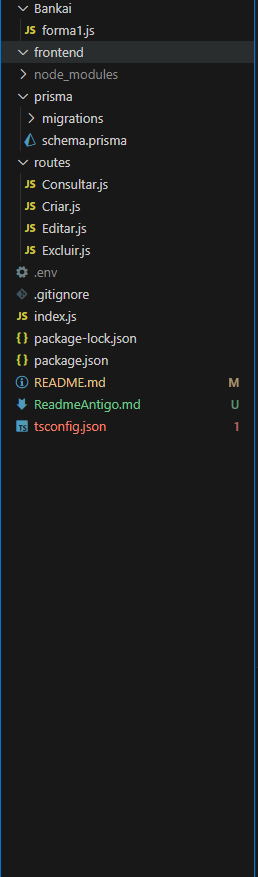

## Introdução
O projeito foi desenvolvido somente até a parte do Back-end, com Node JS. As principais implementações foram até o `Nível 4`, logo conta com:
- Autenticação JWT
- Login e Registro
- Validação
- Persistência (PostgreSQL) e ORM Prisma
- Crud (Criar, Registrar, Atualizar(Update) e Deletar)

Caso esteja se perguntando do porque existe um pasta chamada `Bankai` onde se encontra um arquivo javascript, é apenas para formatação, coisas simples como data, status e em um futuro proximo para o cliente pode ser feito, para listar por prioridade.

## Objetivo do Projeto / Problema / Desafio
O stakeholder da Comigotech solicitou uma nova funcionalidade para o gerenciamento de tickets.
Diariamente, nossa equipe precisa lidar com um grande volume de tickets, e o processo manual estava deixando todos sobrecarregados!
Os tickets são registros digitais de solicitações, processos e problemas a serem resolvidos. Para a Comigotech, é essencial integrar essas informações no fluxo de trabalho para atender nossos clientes de forma eficiente.

## Rotas da API

## Imagens do Projeto

## Organização do Código (Arquitetura)
De um ponto de vista geral essas são as pastas do projeto, foram pensadas para a facilidade de manutenção.

Arquivo ´Index.js´ que é o core da API
